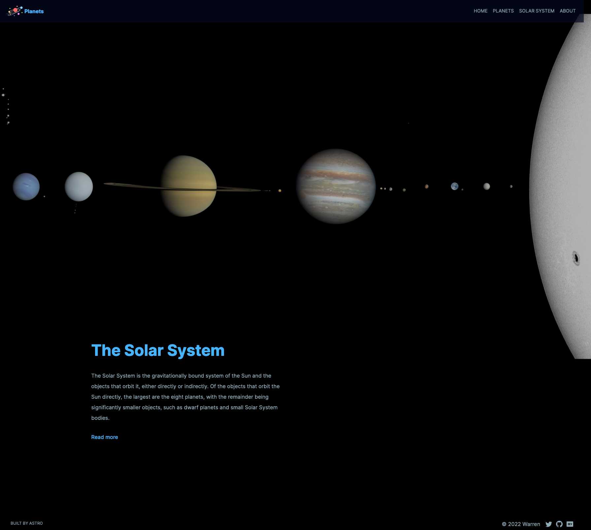

# The Planets of Solar System





## Introduction

The purpose of this project is to demonstrate how to use the [Astro](https://astro.build/) framework to build a website faster. The content is about planets in the Solar system with images and introductions of each planet. The website is responsive for desktop and mobile screens. 

Demo: [Planets](https://our-planets-340bd.web.app/)

Developer: [Warren Chen](https://github.com/ChenWarren/)


## Astro Commands

```
npm create astro@latest -- --template portfolio
```

All commands are run from the root of the project, from a terminal:

| Command                | Action                                           |
| :--------------------- | :----------------------------------------------- |
| `npm install`          | Installs dependencies                            |
| `npm run dev`          | Starts local dev server at `localhost:3000`      |
| `npm run build`        | Build your production site to `./dist/`          |
| `npm run preview`      | Preview your build locally, before deploying     |
| `npm run astro ...`    | Run CLI commands like `astro add`, `astro check` |
| `npm run astro --help` | Get help using the Astro CLI                     |

## 👀 Want to learn more about Astro?

Feel free to check [Astro documentation](https://docs.astro.build) or jump into Astro [Discord server](https://astro.build/chat).
